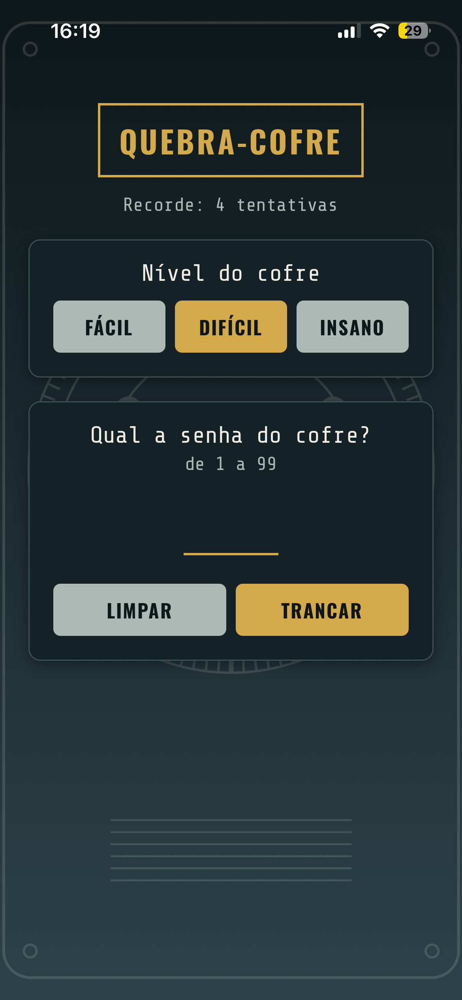

# Quebra-Cofre

Jogo em React Native - Pietra & Maria Eduarda

# Sobre

Você tranca uma senha no cofre e um robô tenta descobrir qual é.
A cada palpite, você diz se ele foi alto demais ou baixo demais, e o robô
vai fechando o cerco até abrir o cofre.

# Como jogar

- Escolha o nível: Fácil (1 a 50), Difícil (1 a 99) ou Insano (1 a 200)
- Digite a senha e toque em Trancar
- O robô mostra um palpite. Toque em Alto ou Baixo para dar a dica
- Dica que contradiz a senha é recusada pela tranca
- Ao abrir o cofre, o jogo mostra as tentativas, as estrelas e o recorde

# Pré-requisitos

- Node.js 18+
- App **Expo Go** no celular

# Como instalar

```
git clone <url-do-repo>
cd quebra-cofre
npm install
```

# Como iniciar

```
npx expo start

# leia o QR Code com o Expo Go
# (ou tecle "a"/"i" p/ emulador)
```

# Print


 